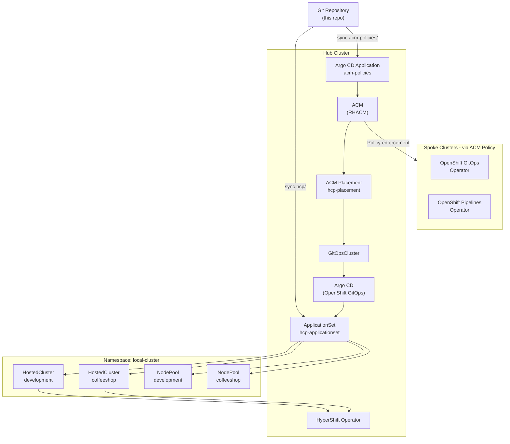
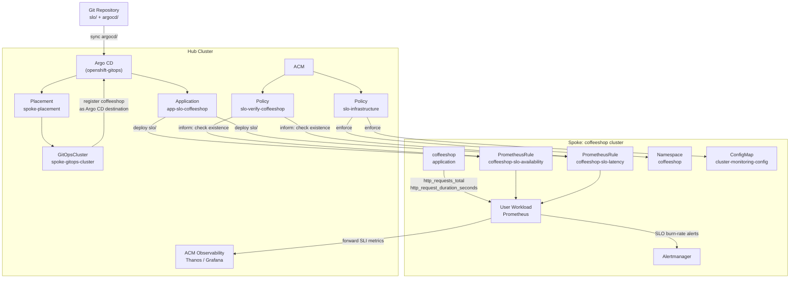

# ACM HCP ArgoCD Demo

This demo shows how to manage OpenShift clusters using **Red Hat Advanced Cluster Management (ACM)**, **HyperShift Hosted Control Planes (HCP)**, and **Argo CD** (OpenShift GitOps). The result is a fully GitOps-driven workflow where adding a `HostedCluster` manifest to this repository is all that is needed to provision a new managed OpenShift cluster on AWS.

## Architecture

The hub cluster runs ACM and Argo CD. ACM `Placement` selects the hub itself via a `GitOpsCluster`, which registers it with Argo CD. An `ApplicationSet` using the `clusterDecisionResource` generator watches the `hcp/` directory in this repository and automatically deploys `HostedCluster` and `NodePool` resources. ACM also propagates operator policies to spoke clusters once they are ready.



## Repository Structure

```
acm_hcp_argocd_demo/
├── README.md
├── acm-policies/                           # ACM Policies applied to hub and/or spoke clusters
│   ├── alertmanager-config-policy.yaml     # Configures Alertmanager receivers on ALL clusters (hub + spokes)
│   ├── openshift-gitops-policy.yaml        # Installs OpenShift GitOps operator on spokes
│   ├── openshift-pipelines-policy.yaml     # Installs OpenShift Pipelines operator on spokes
│   └── slo-observability-policy.yaml       # Policy 1 (enforce, all spokes): user workload monitoring + namespace
│                                           # Policy 2 (inform, coffeeshop only): verifies SLO PrometheusRules exist
├── ansible/
│   └── playbook/
│       ├── create_hcp_cluster_cli.yaml     # Playbook: provision HCP cluster via hcp CLI
│       ├── inventory.yaml                  # Bastion host inventory
│       └── vars/
│           ├── main.yaml                   # Default variables (AWS region, node type, etc.)
│           ├── vault.yaml                  # Encrypted secrets — gitignored, do not commit
│           └── vault.yaml.example          # Template for vault.yaml
├── argocd/                                 # Hub wiring: ACM + Argo CD integration
│   ├── kustomization.yaml                  # Ordered Kustomize entry point
│   ├── acm-placement-configmap.yaml        # Teaches ApplicationSet to read PlacementDecisions
│   ├── app-acm-policies.yaml               # Argo CD Application syncing acm-policies/
│   ├── app-slo-coffeeshop.yaml             # Argo CD Application deploying slo/ to coffeeshop cluster
│   ├── app-slo-grafana-operator.yaml       # Argo CD Application — Phase 1: Grafana Community Operator install
│   ├── app-slo-grafana-instance.yaml       # Argo CD Application — Phase 2: Grafana instance + SLO dashboard
│   ├── appproject.yaml                     # AppProject scoping HyperShift resource kinds
│   ├── applicationset.yaml                 # ApplicationSet deploying hcp/ to local-cluster
│   ├── argocd-acm-policy-rbac.yaml         # RBAC: Argo CD SA → ACM policy/placement kinds
│   ├── argocd-hypershift-rbac.yaml         # RBAC: Argo CD SA → HostedCluster/NodePool kinds
│   ├── gitopscluster-rbac.yaml             # RBAC: ApplicationSet SA → PlacementDecisions
│   ├── gitopscluster.yaml                  # Registers hub with Argo CD via ACM (hub only)
│   ├── managedclustersetbinding.yaml       # Binds default ClusterSet into openshift-gitops ns
│   ├── placement.yaml                      # ACM Placement selecting hub (local-cluster)
│   ├── spoke-placement.yaml                # ACM Placement selecting all spoke clusters
│   └── spoke-gitopscluster.yaml            # Registers spoke clusters with hub Argo CD
├── file_for_demo/
│   └── network-security-policy.yaml        # Example ACM Policy: default-deny NetworkPolicy
├── hcp/                                    # HyperShift manifests — Argo CD sync target
│   ├── hosted_cluster.yaml                 # HostedCluster: development
│   ├── hosted_cluster_coffeeshop.yaml      # HostedCluster: coffeeshop
│   ├── nodePool.yaml                       # NodePool: development
│   └── nodePool_coffeeshop.yaml            # NodePool: coffeeshop
├── docs/
│   └── demo-slo-ops.md                     # Step-by-step SLI/SLO Ops demo script with talking points
├── slo/                                    # SLI/SLO definitions — deployed to spoke clusters
│   ├── kustomization.yaml                  # Kustomize entry point
│   ├── namespace.yaml                      # coffeeshop application namespace
│   ├── coffeeshop-slo-availability.yaml    # PrometheusRule: 99.9 % availability SLO
│   └── coffeeshop-slo-latency.yaml         # PrometheusRule: 95 % p95 ≤ 500 ms latency SLO
└── grafana/                                # Grafana deployment — deployed to spoke clusters
    ├── operator/                           # Phase 1: OLM install of Grafana Community Operator
    │   ├── kustomization.yaml
    │   ├── grafana-namespace.yaml          # Namespace: grafana-slo
    │   ├── grafana-operatorgroup.yaml      # OperatorGroup scoped to grafana-slo
    │   ├── grafana-subscription.yaml       # OLM Subscription: Grafana Community Operator v5
    │   └── grafana-rbac.yaml              # SA + ClusterRoleBinding for Thanos Querier access
    └── instance/                           # Phase 2: Grafana CR, dashboard, and route
        ├── kustomization.yaml
        ├── grafana-datasource-config.yaml  # ConfigMap: file-based Thanos datasource provisioning
        ├── grafana-instance.yaml           # Grafana CR (BEARER_TOKEN injected from Secret)
        ├── grafana-dashboard.yaml          # GrafanaDashboard CR: 9-panel SLO dashboard
        └── grafana-route.yaml             # OpenShift Route exposing the Grafana UI
```

## Prerequisites

Before applying any resources ensure the following are in place on the **hub cluster**:

| Requirement | Notes |
|---|---|
| OpenShift Container Platform hub cluster | Acts as the ACM and HyperShift management plane |
| Red Hat ACM operator installed | Provides `ManagedCluster`, `Placement`, `GitOpsCluster` CRDs |
| OpenShift GitOps operator installed | Provides the Argo CD instance in `openshift-gitops` namespace |
| HyperShift operator enabled | Required to reconcile `HostedCluster` and `NodePool` resources |
| AWS credentials secret on hub | Created with `hcp create secret aws` (see below) |
| `oc` CLI authenticated to hub | Valid kubeconfig pointing to the hub cluster |
| `hcp` CLI on the bastion VM | Required only when using the Ansible playbook |
| Ansible + `kubernetes.core` collection | Required only when using the Ansible playbook |

### Create the AWS credentials secret (one-time)

```bash
hcp create secret aws \
  --name aws-credentials \
  --namespace local-cluster \
  --aws-creds ~/.aws/credentials \
  --pull-secret ~/.pull-secret.json
```

## Deployment

### Step 1 — Apply the ACM + Argo CD hub wiring

This registers the hub cluster with Argo CD and creates the `ApplicationSet` that watches `hcp/`. Apply it once from the root of this repository:

```bash
oc apply -k argocd/
```

Resources are applied in the following order by the Kustomization:

1. `acm-placement-configmap.yaml` — ConfigMap that teaches the `clusterDecisionResource` generator the API shape of ACM `PlacementDecision` objects
2. `gitopscluster-rbac.yaml` — grants the ApplicationSet controller SA read access to `PlacementDecisions`
3. `argocd-hypershift-rbac.yaml` — grants the Argo CD application controller SA full CRUD on `HostedCluster` and `NodePool` resources
4. `argocd-acm-policy-rbac.yaml` — grants the application controller SA access to ACM policy, placement, and `ManagedClusterSetBinding` kinds
5. `managedclustersetbinding.yaml` — binds the `default` ManagedClusterSet into the `openshift-gitops` namespace
6. `placement.yaml` — ACM Placement selecting the hub cluster (`local-cluster: "true"`)
7. `gitopscluster.yaml` — ACM `GitOpsCluster` that registers the hub with Argo CD
8. `spoke-placement.yaml` — ACM Placement selecting all spoke clusters (non-hub ManagedClusters)
9. `spoke-gitopscluster.yaml` — ACM `GitOpsCluster` that registers spoke clusters as Argo CD destinations
10. `appproject.yaml` — Argo CD `AppProject` (`hcp-project`) whitelisting `HostedCluster` and `NodePool` kinds
11. `applicationset.yaml` — Argo CD `ApplicationSet` that generates an Application from the placement result and syncs `hcp/`
12. `app-acm-policies.yaml` — standalone Argo CD `Application` syncing `acm-policies/` to the hub
13. `app-slo-coffeeshop.yaml` — Argo CD `Application` deploying SLO `PrometheusRule` objects to the coffeeshop cluster
14. `app-slo-grafana-operator.yaml` — Argo CD `Application` (Phase 1) installing the Grafana Community Operator on the coffeeshop cluster via OLM; must reach `Synced/Healthy` before Phase 2
15. `app-slo-grafana-instance.yaml` — Argo CD `Application` (Phase 2) deploying the Grafana instance and 9-panel SLO dashboard; uses `SkipDryRunOnMissingResource=true` to tolerate the ~2-3 minute CRD registration delay after Phase 1

### Step 2 — Argo CD reconciles the HCP manifests

Once the `ApplicationSet` is running, Argo CD detects the placement result and automatically creates an `Application` that deploys all resources under `hcp/` (the `HostedCluster` and `NodePool` objects) to the hub cluster in the `local-cluster` namespace.

HyperShift then provisions the control plane for each `HostedCluster`. The hosted cluster becomes visible as a `ManagedCluster` in ACM once its API server is ready.

### Step 3 (optional) — Provision a new hosted cluster with Ansible

The Ansible playbook automates the full lifecycle for provisioning a new hosted cluster via the `hcp` CLI on a bastion VM. After the cluster is ready it:

1. Labels the `ManagedCluster` with `rhdp_type`
2. Exports the `HostedCluster` and `NodePool` resources as clean YAML files into `hcp/`
3. Commits and pushes the changes to this repository

Argo CD then picks up the new files and completes the GitOps loop.

See [Ansible Playbook](#ansible-playbook) in the commands section for the exact commands.

## ACM Policies

### All ACM policies (`acm-policies/`)

All policies in this directory are synced to the hub by the `app-acm-policies` Argo CD Application and then enforced or evaluated by ACM across the appropriate clusters.

| Policy file | Placement | Action | Purpose |
|---|---|---|---|
| `alertmanager-config-policy.yaml` | All clusters (hub + spokes) | enforce | Configures Alertmanager receivers and inhibit rules; silences the `AlertmanagerReceiversNotConfigured` warning on every cluster |
| `openshift-gitops-policy.yaml` | Spoke clusters only | enforce | Installs the OpenShift GitOps (Argo CD) operator via OLM Subscription in `openshift-operators` |
| `openshift-pipelines-policy.yaml` | Spoke clusters only | enforce | Installs the OpenShift Pipelines (Tekton) operator via OLM Subscription in `openshift-operators` |
| `slo-observability-policy.yaml` | See below | enforce / inform | Two sub-policies: `slo-infrastructure` (enforce, all spokes) enables user workload monitoring; `slo-verify-coffeeshop` (inform, coffeeshop only) raises a violation if SLO `PrometheusRule` objects are missing |

### Network security policy demo (`file_for_demo/`)

`network-security-policy.yaml` is a standalone ACM `Policy` example that enforces a **default-deny** `NetworkPolicy` (both Ingress and Egress) on all user namespaces of clusters labelled `rhdp_type=sandbox`. It excludes core system namespaces (`default`, `kube-*`, `openshift*`, `open-cluster-management*`, etc.).

This file is not automatically synced by Argo CD; it is applied manually for demonstration purposes.

---

## SLI / SLO Ops

> For a full step-by-step demo script with talking points, PromQL queries, and a simulated incident walkthrough, see [docs/demo-slo-ops.md](docs/demo-slo-ops.md).

### What are SLIs and SLOs?

| Term | Meaning | Example |
|---|---|---|
| **SLI** — Service Level Indicator | A quantitative measurement of a service behavior | Ratio of HTTP requests that return a non-5xx response |
| **SLO** — Service Level Objective | A target value (or range) for an SLI over a time window | 99.9 % of requests succeed over any 28-day rolling window |
| **Error Budget** | The allowed margin of failure before the SLO is breached | 0.1 % of requests may fail ≈ 40 minutes of full outage per 28 days |
| **Burn Rate** | How fast the error budget is being consumed relative to sustainable pace | 14.4× burn = 2 % of budget gone in 1 hour |

**SLO Ops** is the practice of managing SLOs as code, delivered via GitOps, and enforced consistently across every cluster in your fleet. In this demo:

* SLO definitions live in the `slo/` directory as `PrometheusRule` objects.
* Argo CD deploys them to the correct clusters (the coffeeshop spoke cluster in this case).
* ACM Policies enforce the infrastructure prerequisites (user workload monitoring enabled) and raise a compliance violation if the rules are missing.
* ACM Observability aggregates metrics across all clusters into a central Thanos instance so you can build a single cross-cluster SLO dashboard.

---

### SLI / SLO Architecture



---

### SLOs Defined in This Demo

#### Coffeeshop — Availability SLO (`slo/coffeeshop-slo-availability.yaml`)

| Property | Value |
|---|---|
| **SLI** | Fraction of HTTP requests that return a non-5xx status code |
| **SLO target** | 99.9 % over a 28-day rolling window |
| **Error budget** | 0.1 % ≈ 40 minutes of permitted errors per 28 days |

Multi-burn-rate alerts:

| Alert | Severity | Windows | Burn rate | Budget consumed |
|---|---|---|---|---|
| `CoffeeshopAvailabilityCriticalFastBurn` | critical | 5 m + 1 h | 14.4 × | 2 % in 1 h — page now |
| `CoffeeshopAvailabilityCriticalSlowBurn` | critical | 30 m + 6 h | 6 × | 5 % in 6 h — page soon |
| `CoffeeshopAvailabilityWarningSlowBurn` | warning | 6 h + 3 d | 1 × | budget exhaustion imminent |
| `CoffeeshopAvailabilityErrorBudgetLow` | info | 28 d | — | < 25 % budget remaining |

#### Coffeeshop — Latency SLO (`slo/coffeeshop-slo-latency.yaml`)

| Property | Value |
|---|---|
| **SLI** | Fraction of HTTP requests served within 500 ms |
| **SLO target** | 95 % of requests ≤ 500 ms over a 28-day rolling window |
| **Error budget** | 5 % of requests may exceed 500 ms |

Multi-burn-rate alerts:

| Alert | Severity | Windows | Burn rate | Budget consumed |
|---|---|---|---|---|
| `CoffeeshopLatencyCriticalFastBurn` | critical | 5 m + 1 h | 14.4 × | 2 % in 1 h — page now |
| `CoffeeshopLatencyCriticalSlowBurn` | critical | 30 m + 6 h | 6 × | 5 % in 6 h — page soon |
| `CoffeeshopLatencyWarningSlowBurn` | warning | 6 h + 3 d | 1 × | budget exhaustion imminent |

---

### How the Multi-Burn-Rate Alert Strategy Works

The standard single-threshold alert (`error_rate > 0.1 %`) generates too many false positives for short-lived spikes and alerts too slowly for sustained incidents.

**Multi-burn-rate alerting** (from the Google SRE Book, Chapter 5) uses pairs of windows:

1. A **long window** detects a sustained trend.
2. A **short window** confirms the issue is still happening _right now_.

Both must be elevated simultaneously, which dramatically reduces false positives while keeping detection time low for fast burns.

```
Error rate 2.0 %  ──┐  14.4 × budget (critical)  → page within 5 minutes
                    │
Error rate 0.6 %  ──┤   6.0 × budget (critical)  → page within 30 minutes
                    │
Error rate 0.1 %  ──┘   1.0 × budget (warning)   → ticket within 6 hours
                     (SLO threshold = 0.1 %)
```

---

### Deploying the SLO Demo

#### Step 1 — Enable user workload monitoring via ACM Policy

`slo-observability-policy.yaml` in `acm-policies/` is already picked up by the `acm-policies` Argo CD Application. It defines **two separate policies** with different placements to avoid false violations:

| Policy | Placement | Action | Purpose |
|---|---|---|---|
| `slo-infrastructure` | all spokes | enforce | Enables user workload monitoring + creates the `coffeeshop` namespace |
| `slo-verify-coffeeshop` | `coffeeshop` cluster only | inform | Reports NonCompliant if Argo CD has not yet deployed the SLO rules |

The verify policy is scoped to the coffeeshop cluster only because the `PrometheusRule` objects are only deployed there — putting it on all spokes would produce a permanent violation on clusters that do not run the coffeeshop workload.

```bash
# Verify both policies are synced
oc get policy slo-infrastructure slo-verify-coffeeshop -n acm-policies

# Check enforcement status on all clusters
oc get policy.open-cluster-management.io -A | grep slo
```

#### Step 2 — Register spoke clusters with hub Argo CD and deploy SLO rules

`spoke-placement.yaml` and `spoke-gitopscluster.yaml` are already included in `argocd/kustomization.yaml`, so re-applying the hub wiring registers all spoke clusters as Argo CD destinations and deploys the SLO `Application` in one shot:

```bash
# Re-apply the hub wiring (idempotent — safe to run again)
oc apply -k argocd/

# Verify the spoke clusters are now registered with Argo CD
# (ACM creates a cluster secret for each spoke in openshift-gitops)
oc get secret -n openshift-gitops -l argocd.argoproj.io/secret-type=cluster

# Verify the SLO Application was created and is syncing
oc get application slo-coffeeshop -n openshift-gitops

# Force a manual sync if needed
oc patch application slo-coffeeshop -n openshift-gitops \
  --type merge \
  -p '{"operation": {"sync": {}}}'
```

#### Step 3 — Verify the PrometheusRules on the coffeeshop cluster

```bash
# Switch context to the coffeeshop cluster
export KUBECONFIG=./kubeconfig   # extracted from the hosted cluster secret

# Confirm both PrometheusRule objects exist
oc get prometheusrule -n coffeeshop

# Confirm user workload monitoring is active
oc get pods -n openshift-user-workload-monitoring

# Query the SLI recording rule directly from the Prometheus API
oc -n openshift-user-workload-monitoring exec -c prometheus \
  $(oc get pod -n openshift-user-workload-monitoring -l app.kubernetes.io/name=prometheus -o name | head -1) \
  -- curl -s 'http://localhost:9090/api/v1/query?query=job:coffeeshop_http_errors:ratio_rate5m' \
  | python3 -m json.tool
```

#### Step 4 — Simulate an SLO breach (demo scenario)

To show a burn-rate alert firing, you can inject errors or throttle the application to push the error rate above the alert threshold:

```bash
# On the coffeeshop cluster — scale down the app to simulate an outage
oc scale deployment coffeeshop --replicas=0 -n coffeeshop

# Watch the error ratio recording rule climb (run on the hub via ACM Observability,
# or locally on the spoke via the user workload Prometheus)
watch -n 5 'oc -n openshift-user-workload-monitoring exec \
  $(oc get pod -n openshift-user-workload-monitoring -l app.kubernetes.io/name=prometheus -o name | head -1) \
  -c prometheus -- \
  curl -s "http://localhost:9090/api/v1/query?query=job:coffeeshop_http_errors:ratio_rate5m"'

# Restore the application
oc scale deployment coffeeshop --replicas=1 -n coffeeshop
```

#### Step 5 — Observe across clusters via ACM Observability

ACM Observability (MultiClusterObservability operator) aggregates metrics from all managed clusters into a central Thanos instance on the hub. Once the add-on is active, you can query the SLI metrics from all clusters in a single Grafana instance.

```bash
# Check that the observability add-on is active on the coffeeshop cluster
oc get managedclusteraddon observability-controller \
  -n coffeeshop

# Open the ACM Grafana dashboard (hub cluster)
oc get route grafana -n open-cluster-management-observability -o jsonpath='{.spec.host}'
```

Useful PromQL queries for the ACM Grafana dashboards:

```promql
# Error budget remaining (1 = full, 0 = exhausted) — all clusters
job:coffeeshop_availability_slo:error_budget_remaining

# 5-minute error ratio per cluster
job:coffeeshop_http_errors:ratio_rate5m

# p95 latency per cluster
job:coffeeshop_latency_p95:rate5m

# Active burn-rate alerts
ALERTS{slo=~"availability|latency", service="coffeeshop"}
```

#### Step 6 — Deploy and access the per-cluster Grafana SLO dashboard

In addition to ACM Observability's cross-cluster Thanos/Grafana, this demo deploys a dedicated **Grafana Community Operator** instance directly on the coffeeshop spoke cluster. It provides a 9-panel SLO dashboard with no dependency on the hub observability stack.

The two Argo CD Applications are deployed in order by `oc apply -k argocd/` (items 14-15 in the kustomization):

| Application | Path synced | Purpose |
|---|---|---|
| `slo-grafana-operator` | `grafana/operator/` | Installs the Grafana Community Operator v5 via OLM into `grafana-slo` namespace |
| `slo-grafana-instance` | `grafana/instance/` | Deploys the Grafana CR, configures a Thanos Querier datasource, loads the SLO dashboard, and creates an OpenShift Route |

> **Deployment order matters.** OLM takes ~2-3 minutes to register the `grafana.integreatly.org` CRDs after the Subscription is created. `slo-grafana-instance` uses `SkipDryRunOnMissingResource=true` to tolerate this window, but you may need to trigger a manual re-sync once the operator is healthy.

```bash
# Check both Grafana Applications are Synced/Healthy (run on hub)
oc get application slo-grafana-operator slo-grafana-instance -n openshift-gitops

# If slo-grafana-instance is OutOfSync due to CRD timing, force a re-sync
oc patch application slo-grafana-instance -n openshift-gitops \
  --type merge \
  -p '{"operation": {"sync": {}}}'

# Get the Grafana dashboard URL (run with KUBECONFIG pointing to coffeeshop cluster)
oc get route -n grafana-slo -o jsonpath='https://{.items[0].spec.host}{"\n"}'
```

The dashboard panels include availability error ratio, p95 latency, error budget remaining, and active burn-rate alerts — all sourced from the Thanos Querier running on the coffeeshop cluster.

---

### Adding SLOs for New Clusters or Services

The GitOps model makes it trivial to add SLOs for new services or clusters:

1. Create a new `PrometheusRule` YAML in `slo/` following the same pattern.
2. Add it to `slo/kustomization.yaml`.
3. If the new SLO targets a different cluster, create a corresponding `argocd/app-slo-<cluster>.yaml`.
4. Commit and push — Argo CD reconciles the change automatically.

For a new cluster to receive the SLO infrastructure prerequisites (user workload monitoring), it must match the `slo-observability-placement` ACM Placement — which currently targets all spokes. No additional action is needed.

---

### Hub setup — Argo CD wiring

```bash
# Apply all ACM + Argo CD hub resources in the correct order
oc apply -k argocd/

# Verify the ApplicationSet was created
oc get applicationset -n openshift-gitops

# Verify the Application generated by the ApplicationSet
oc get application -n openshift-gitops

# Verify the GitOpsCluster registration
oc get gitopscluster -n openshift-gitops
```

### Hosted cluster management

```bash
# List all hosted clusters on the hub
oc get hostedcluster -n local-cluster

# List all node pools
oc get nodepool -n local-cluster

# Wait for a hosted cluster to become available (up to 30 minutes)
oc wait hostedcluster/<cluster-name> \
  -n local-cluster \
  --for=condition=Available \
  --timeout=30m

# Check the status of a specific hosted cluster
oc describe hostedcluster/<cluster-name> -n local-cluster

# Label a ManagedCluster after it has been registered with ACM
# rhdp_type drives which ACM policies are applied to the cluster
oc label managedcluster <cluster-name> rhdp_type=sandbox
```

### Kubeconfig / cluster access

```bash
# Extract the admin kubeconfig for a hosted cluster
oc extract -n local-cluster secret/<cluster-name>-admin-kubeconfig --to=-

# Save the kubeconfig to a file for ongoing use
oc extract -n local-cluster secret/<cluster-name>-admin-kubeconfig \
  --to=. \
  --keys=kubeconfig

# Use the extracted kubeconfig
export KUBECONFIG=./kubeconfig
oc get nodes
```

### ACM policies

```bash
# Apply the operator installation policies (also managed by Argo CD)
oc apply -f acm-policies/openshift-gitops-policy.yaml
oc apply -f acm-policies/openshift-pipelines-policy.yaml

# Check policy compliance across all clusters
oc get policy -n acm-policies

# Apply the network security demo policy manually
oc apply -f file_for_demo/network-security-policy.yaml

# Check compliance of the network security policy
oc get policy network-security-secure -n acm-policies
```

### Ansible playbook

#### Option A — Interactive SSH password prompt

```bash
ansible-playbook ansible/playbook/create_hcp_cluster_cli.yaml \
  -i ansible/playbook/inventory.yaml \
  -e @ansible/playbook/vars/main.yaml \
  --ask-pass \
  -e cluster_name=<cluster-name> \
  -e rhdp_type=sandbox
```

#### Option B — Ansible Vault (non-interactive)

```bash
# Step 1 — Create the vault file from the example template
cp ansible/playbook/vars/vault.yaml.example ansible/playbook/vars/vault.yaml

# Step 2 — Edit vault.yaml and set vault_bastion_password, then encrypt it
ansible-vault encrypt ansible/playbook/vars/vault.yaml

# Step 3 — Run the playbook
ansible-playbook ansible/playbook/create_hcp_cluster_cli.yaml \
  -i ansible/playbook/inventory.yaml \
  -e @ansible/playbook/vars/main.yaml \
  -e @ansible/playbook/vars/vault.yaml \
  --ask-vault-pass \
  -e cluster_name=<cluster-name> \
  -e rhdp_type=sandbox
```

Key variables that can be overridden at runtime with `-e`:

| Variable | Default | Description |
|---|---|---|
| `cluster_name` | `sandbox` | Name of the hosted cluster to create |
| `rhdp_type` | `sandbox` | ACM label applied to the ManagedCluster after provisioning |
| `aws_region` | `us-west-2` | AWS region for the hosted cluster |
| `node_instance_type` | `m6a.xlarge` | EC2 instance type for worker nodes |
| `node_replica_count` | `1` | Number of worker nodes in the NodePool |
| `ocp_release_image` | `quay.io/openshift-release-dev/ocp-release:4.14.3-x86_64` | OCP release image |

### HyperShift CLI — AWS credentials secret

```bash
# Create the AWS credentials secret on the hub (one-time setup)
hcp create secret aws \
  --name aws-credentials \
  --namespace local-cluster \
  --aws-creds ~/.aws/credentials \
  --pull-secret ~/.pull-secret.json
```

### Argo CD sync operations

```bash
# Force a manual sync of the HCP application
oc patch application -n openshift-gitops <app-name> \
  --type merge \
  -p '{"operation": {"sync": {}}}'

# List all Argo CD applications and their sync status
oc get application -n openshift-gitops -o wide

# List all ApplicationSets
oc get applicationset -n openshift-gitops
```

### SLI / SLO operations

```bash
# Deploy the SLO Argo CD Application
oc apply -f argocd/app-slo-coffeeshop.yaml

# Check SLO Application sync status
oc get application slo-coffeeshop -n openshift-gitops

# Check both SLO policies
oc get policy slo-infrastructure slo-verify-coffeeshop -n acm-policies

# Check propagated policy status across all clusters
oc get policy.open-cluster-management.io -A | grep slo

# Verify PrometheusRules exist on the coffeeshop spoke cluster
# (requires KUBECONFIG pointing to the coffeeshop cluster)
oc get prometheusrule -n coffeeshop

# Verify user workload monitoring pods are running on a spoke cluster
oc get pods -n openshift-user-workload-monitoring

# Query the availability error ratio from the user workload Prometheus (spoke)
oc -n openshift-user-workload-monitoring exec \
  $(oc get pod -n openshift-user-workload-monitoring \
    -l app.kubernetes.io/name=prometheus -o name | head -1) \
  -c prometheus -- \
  curl -s 'http://localhost:9090/api/v1/query?query=job:coffeeshop_http_errors:ratio_rate5m'

# Query the remaining error budget (28-day window)
oc -n openshift-user-workload-monitoring exec \
  $(oc get pod -n openshift-user-workload-monitoring \
    -l app.kubernetes.io/name=prometheus -o name | head -1) \
  -c prometheus -- \
  curl -s 'http://localhost:9090/api/v1/query?query=job:coffeeshop_availability_slo:error_budget_remaining'

# Check active SLO burn-rate alerts
oc -n openshift-user-workload-monitoring exec \
  $(oc get pod -n openshift-user-workload-monitoring \
    -l app.kubernetes.io/name=prometheus -o name | head -1) \
  -c prometheus -- \
  curl -s 'http://localhost:9090/api/v1/alerts' | python3 -m json.tool

# Get the ACM Observability Grafana URL (hub cluster)
oc get route grafana -n open-cluster-management-observability \
  -o jsonpath='https://{.spec.host}\n'

# --- Grafana Community Operator (per-cluster SLO dashboard) ---

# Check both Grafana Argo CD Applications are Synced/Healthy (hub cluster)
oc get application slo-grafana-operator slo-grafana-instance -n openshift-gitops

# Force a re-sync of the Grafana instance Application if CRD timing caused OutOfSync
oc patch application slo-grafana-instance -n openshift-gitops \
  --type merge \
  -p '{"operation": {"sync": {}}}'

# Get the Grafana dashboard URL on the coffeeshop spoke cluster
# (requires KUBECONFIG pointing to the coffeeshop cluster)
oc get route -n grafana-slo \
  -o jsonpath='https://{.items[0].spec.host}{"\n"}'

# Check that the Grafana pod is running on the coffeeshop cluster
oc get pods -n grafana-slo

# Check the Alertmanager config policy compliance across all clusters
oc get policy alertmanager-config -n acm-policies
```
