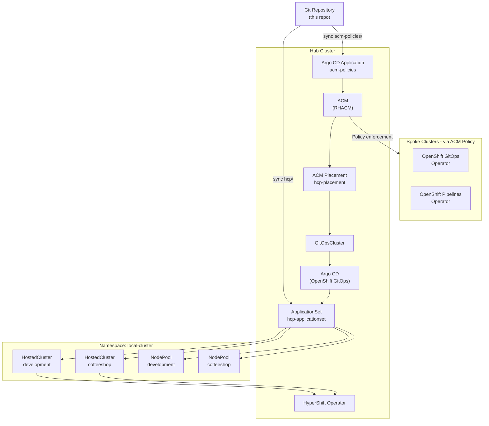

# ACM HCP ArgoCD Demo

This demo shows how to manage OpenShift clusters using **Red Hat Advanced Cluster Management (ACM)**, **HyperShift Hosted Control Planes (HCP)**, and **Argo CD** (OpenShift GitOps). The result is a fully GitOps-driven workflow where adding a `HostedCluster` manifest to this repository is all that is needed to provision a new managed OpenShift cluster on AWS.

## Architecture

The hub cluster runs ACM and Argo CD. ACM `Placement` selects the hub itself via a `GitOpsCluster`, which registers it with Argo CD. An `ApplicationSet` using the `clusterDecisionResource` generator watches the `hcp/` directory in this repository and automatically deploys `HostedCluster` and `NodePool` resources. ACM also propagates operator policies to spoke clusters once they are ready.



## Repository Structure

```
acm_hcp_argocd_demo/
├── README.md
├── acm-policies/                           # ACM Policies applied to spoke clusters
│   ├── openshift-gitops-policy.yaml        # Installs OpenShift GitOps operator on spokes
│   └── openshift-pipelines-policy.yaml     # Installs OpenShift Pipelines operator on spokes
├── ansible/
│   └── playbook/
│       ├── create_hcp_cluster_cli.yaml     # Playbook: provision HCP cluster via hcp CLI
│       ├── inventory.yaml                  # Bastion host inventory
│       └── vars/
│           ├── main.yaml                   # Default variables (AWS region, node type, etc.)
│           ├── vault.yaml                  # Encrypted secrets — gitignored, do not commit
│           └── vault.yaml.example          # Template for vault.yaml
├── argocd/                                 # Hub wiring: ACM + Argo CD integration
│   ├── kustomization.yaml                  # Ordered Kustomize entry point
│   ├── acm-placement-configmap.yaml        # Teaches ApplicationSet to read PlacementDecisions
│   ├── acm-placement-configmap.yaml
│   ├── app-acm-policies.yaml               # Argo CD Application syncing acm-policies/
│   ├── appproject.yaml                     # AppProject scoping HyperShift resource kinds
│   ├── applicationset.yaml                 # ApplicationSet deploying hcp/ to local-cluster
│   ├── argocd-acm-policy-rbac.yaml         # RBAC: Argo CD SA → ACM policy/placement kinds
│   ├── argocd-hypershift-rbac.yaml         # RBAC: Argo CD SA → HostedCluster/NodePool kinds
│   ├── gitopscluster-rbac.yaml             # RBAC: ApplicationSet SA → PlacementDecisions
│   ├── gitopscluster.yaml                  # Registers hub with Argo CD via ACM
│   ├── managedclustersetbinding.yaml       # Binds default ClusterSet into openshift-gitops ns
│   └── placement.yaml                      # ACM Placement selecting hub (local-cluster)
├── file_for_demo/
│   └── network-security-policy.yaml        # Example ACM Policy: default-deny NetworkPolicy
└── hcp/                                    # HyperShift manifests — Argo CD sync target
    ├── hosted_cluster.yaml                 # HostedCluster: development
    ├── hosted_cluster_coffeeshop.yaml      # HostedCluster: coffeeshop
    ├── nodePool.yaml                       # NodePool: development
    └── nodePool_coffeeshop.yaml            # NodePool: coffeeshop
```

## Prerequisites

Before applying any resources ensure the following are in place on the **hub cluster**:

| Requirement | Notes |
|---|---|
| OpenShift Container Platform hub cluster | Acts as the ACM and HyperShift management plane |
| Red Hat ACM operator installed | Provides `ManagedCluster`, `Placement`, `GitOpsCluster` CRDs |
| OpenShift GitOps operator installed | Provides the Argo CD instance in `openshift-gitops` namespace |
| HyperShift operator enabled | Required to reconcile `HostedCluster` and `NodePool` resources |
| AWS credentials secret on hub | Created with `hcp create secret aws` (see below) |
| `oc` CLI authenticated to hub | Valid kubeconfig pointing to the hub cluster |
| `hcp` CLI on the bastion VM | Required only when using the Ansible playbook |
| Ansible + `kubernetes.core` collection | Required only when using the Ansible playbook |

### Create the AWS credentials secret (one-time)

```bash
hcp create secret aws \
  --name aws-credentials \
  --namespace local-cluster \
  --aws-creds ~/.aws/credentials \
  --pull-secret ~/.pull-secret.json
```

## Deployment

### Step 1 — Apply the ACM + Argo CD hub wiring

This registers the hub cluster with Argo CD and creates the `ApplicationSet` that watches `hcp/`. Apply it once from the root of this repository:

```bash
oc apply -k argocd/
```

Resources are applied in the following order by the Kustomization:

1. `acm-placement-configmap.yaml` — ConfigMap that teaches the `clusterDecisionResource` generator the API shape of ACM `PlacementDecision` objects
2. `gitopscluster-rbac.yaml` — grants the ApplicationSet controller SA read access to `PlacementDecisions`
3. `argocd-hypershift-rbac.yaml` — grants the Argo CD application controller SA full CRUD on `HostedCluster` and `NodePool` resources
4. `argocd-acm-policy-rbac.yaml` — grants the application controller SA access to ACM policy, placement, and `ManagedClusterSetBinding` kinds
5. `managedclustersetbinding.yaml` — binds the `default` ManagedClusterSet into the `openshift-gitops` namespace
6. `placement.yaml` — ACM Placement selecting the hub cluster (`local-cluster: "true"`)
7. `gitopscluster.yaml` — ACM `GitOpsCluster` that registers the selected clusters with Argo CD
8. `appproject.yaml` — Argo CD `AppProject` (`hcp-project`) whitelisting `HostedCluster` and `NodePool` kinds
9. `applicationset.yaml` — Argo CD `ApplicationSet` that generates an Application from the placement result and syncs `hcp/`
10. `app-acm-policies.yaml` — standalone Argo CD `Application` syncing `acm-policies/` to the hub

### Step 2 — Argo CD reconciles the HCP manifests

Once the `ApplicationSet` is running, Argo CD detects the placement result and automatically creates an `Application` that deploys all resources under `hcp/` (the `HostedCluster` and `NodePool` objects) to the hub cluster in the `local-cluster` namespace.

HyperShift then provisions the control plane for each `HostedCluster`. The hosted cluster becomes visible as a `ManagedCluster` in ACM once its API server is ready.

### Step 3 (optional) — Provision a new hosted cluster with Ansible

The Ansible playbook automates the full lifecycle for provisioning a new hosted cluster via the `hcp` CLI on a bastion VM. After the cluster is ready it:

1. Labels the `ManagedCluster` with `rhdp_type`
2. Exports the `HostedCluster` and `NodePool` resources as clean YAML files into `hcp/`
3. Commits and pushes the changes to this repository

Argo CD then picks up the new files and completes the GitOps loop.

See [Ansible Playbook](#ansible-playbook) in the commands section for the exact commands.

## ACM Policies

### Operator installation policies (`acm-policies/`)

These policies are synced to the hub by Argo CD and then enforced by ACM on all **spoke clusters** in the `default` ManagedClusterSet (i.e. every cluster where `local-cluster != "true"`):

| Policy | What it installs |
|---|---|
| `openshift-gitops-policy.yaml` | OpenShift GitOps (Argo CD) operator via Subscription in the `openshift-operators` namespace |
| `openshift-pipelines-policy.yaml` | OpenShift Pipelines (Tekton) operator via Subscription in the `openshift-operators` namespace |

### Network security policy demo (`file_for_demo/`)

`network-security-policy.yaml` is a standalone ACM `Policy` example that enforces a **default-deny** `NetworkPolicy` (both Ingress and Egress) on all user namespaces of clusters labelled `rhdp_type=sandbox`. It excludes core system namespaces (`default`, `kube-*`, `openshift*`, `open-cluster-management*`, etc.).

This file is not automatically synced by Argo CD; it is applied manually for demonstration purposes.

---

## Manual Commands Reference

### Hub setup — Argo CD wiring

```bash
# Apply all ACM + Argo CD hub resources in the correct order
oc apply -k argocd/

# Verify the ApplicationSet was created
oc get applicationset -n openshift-gitops

# Verify the Application generated by the ApplicationSet
oc get application -n openshift-gitops

# Verify the GitOpsCluster registration
oc get gitopscluster -n openshift-gitops
```

### Hosted cluster management

```bash
# List all hosted clusters on the hub
oc get hostedcluster -n local-cluster

# List all node pools
oc get nodepool -n local-cluster

# Wait for a hosted cluster to become available (up to 30 minutes)
oc wait hostedcluster/<cluster-name> \
  -n local-cluster \
  --for=condition=Available \
  --timeout=30m

# Check the status of a specific hosted cluster
oc describe hostedcluster/<cluster-name> -n local-cluster

# Label a ManagedCluster after it has been registered with ACM
# rhdp_type drives which ACM policies are applied to the cluster
oc label managedcluster <cluster-name> rhdp_type=sandbox
```

### Kubeconfig / cluster access

```bash
# Extract the admin kubeconfig for a hosted cluster
oc extract -n local-cluster secret/<cluster-name>-admin-kubeconfig --to=-

# Save the kubeconfig to a file for ongoing use
oc extract -n local-cluster secret/<cluster-name>-admin-kubeconfig \
  --to=. \
  --keys=kubeconfig

# Use the extracted kubeconfig
export KUBECONFIG=./kubeconfig
oc get nodes
```

### ACM policies

```bash
# Apply the operator installation policies (also managed by Argo CD)
oc apply -f acm-policies/openshift-gitops-policy.yaml
oc apply -f acm-policies/openshift-pipelines-policy.yaml

# Check policy compliance across all clusters
oc get policy -n acm-policies

# Apply the network security demo policy manually
oc apply -f file_for_demo/network-security-policy.yaml

# Check compliance of the network security policy
oc get policy network-security-secure -n acm-policies
```

### Ansible playbook

#### Option A — Interactive SSH password prompt

```bash
ansible-playbook ansible/playbook/create_hcp_cluster_cli.yaml \
  -i ansible/playbook/inventory.yaml \
  -e @ansible/playbook/vars/main.yaml \
  --ask-pass \
  -e cluster_name=<cluster-name> \
  -e rhdp_type=sandbox
```

#### Option B — Ansible Vault (non-interactive)

```bash
# Step 1 — Create the vault file from the example template
cp ansible/playbook/vars/vault.yaml.example ansible/playbook/vars/vault.yaml

# Step 2 — Edit vault.yaml and set vault_bastion_password, then encrypt it
ansible-vault encrypt ansible/playbook/vars/vault.yaml

# Step 3 — Run the playbook
ansible-playbook ansible/playbook/create_hcp_cluster_cli.yaml \
  -i ansible/playbook/inventory.yaml \
  -e @ansible/playbook/vars/main.yaml \
  -e @ansible/playbook/vars/vault.yaml \
  --ask-vault-pass \
  -e cluster_name=<cluster-name> \
  -e rhdp_type=sandbox
```

Key variables that can be overridden at runtime with `-e`:

| Variable | Default | Description |
|---|---|---|
| `cluster_name` | `sandbox` | Name of the hosted cluster to create |
| `rhdp_type` | `sandbox` | ACM label applied to the ManagedCluster after provisioning |
| `aws_region` | `us-west-2` | AWS region for the hosted cluster |
| `node_instance_type` | `m6a.xlarge` | EC2 instance type for worker nodes |
| `node_replica_count` | `1` | Number of worker nodes in the NodePool |
| `ocp_release_image` | `quay.io/openshift-release-dev/ocp-release:4.14.3-x86_64` | OCP release image |

### HyperShift CLI — AWS credentials secret

```bash
# Create the AWS credentials secret on the hub (one-time setup)
hcp create secret aws \
  --name aws-credentials \
  --namespace local-cluster \
  --aws-creds ~/.aws/credentials \
  --pull-secret ~/.pull-secret.json
```

### Argo CD sync operations

```bash
# Force a manual sync of the HCP application
oc patch application -n openshift-gitops <app-name> \
  --type merge \
  -p '{"operation": {"sync": {}}}'

# List all Argo CD applications and their sync status
oc get application -n openshift-gitops -o wide

# List all ApplicationSets
oc get applicationset -n openshift-gitops
```
